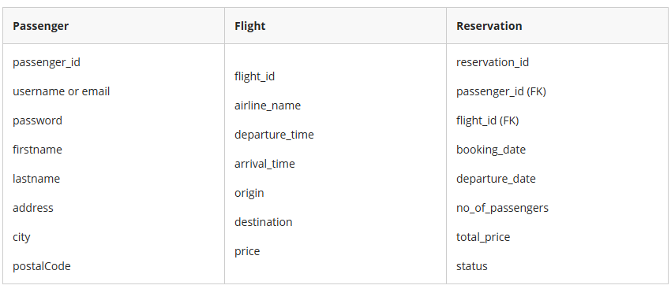

# Online Flight Reservation System

## Purpose
Develop a Spring Boot-based web application for an Online Flight Reservation System, implementing CRUD functionality using JPA and Hibernate. The application should connect to a MySQL database and provide a user-friendly interface for customers to book, view, modify, and cancel flight reservations.

- Design, code and test a Spring Boot MVC app with Thymeleaf template and Spring Data JPA.  
- Design and Implement MySQL database to connect with Spring Boot JPA.

## Functional Requirements

### 1. User Login and Registration
The Home (Index) Page should include:
- A **Customer Sign In** option for existing users.
- A **Sign Up** link for new customers to register.

### 2. Flight Reservation
Upon successful login, customers will be redirected to the Reservation Page, where they can:
- Select Departure and Arrival dates and times.
- Enter the number of passengers (adults and children).
- View the flight price, airline logo/image, and other details (preferred).

### 3. Payment Integration
After selecting flight details, customers proceed to checkout.

Provide options for credit/debit card, PayPal, Apple or Google Pay payments.

**Note:** Payment details should **NOT** be stored in the database.

### 4. Payment Confirmation
Display a confirmation message (on-page or as an alert or a dialog box) upon successful payment.

### 5. Modify Reservation
Customers should be able to:
- Edit their reservation details (e.g., change flight dates, passenger count).

### 6. Cancel Reservation
Allow customers to cancel their reservation up to 10 days before departure.

Implement date validation logic to enforce this rule.

### 7. Customer Profile Management
Customers can access their profile page to:
- View and update personal information such as address, phone number, password etc.

### 8. Server Side Validation
Server-side validation can be implemented using appropriate annotations in the entity class, along with error handling tags in the corresponding Thymeleaf template(s).

### 9. Web Interface Design
Design a clean, accessible, and user-friendly interface using:
- Thymeleaf HTML files.
- CSS or Bootstrap for styling.
- Include relevant images and branding for a professional appearance.

### 10. Database Requirements (MySQL)
Create a relational database named **\"Reservation\"** with at least the following three main relations/tables:

